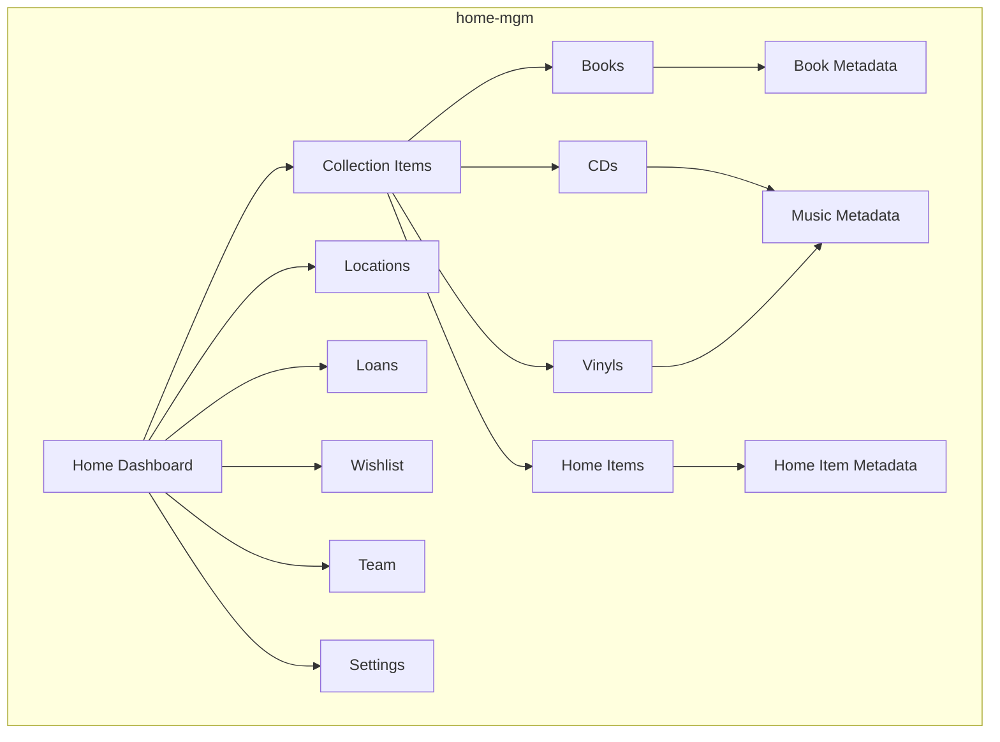

# Home Management App (home-mgm) Extraction Plan

## Overview
Extract the Personal Inventory / Collector feature from InteTeam CRM into a standalone home management application called **home-mgm**. This will be a new GitHub repository focused on personal home inventory and management.

## App Identity

### Name
- **App Name**: home-mgm (Home Management)
- **Display Name**: HomeMGM
- **Tagline**: Your Personal Home Inventory Manager

### Purpose
A PWA-enabled home management application for tracking personal belongings, collections, loans, and household items.

## Architecture Overview



## File Extraction Strategy

### 1. Core Laravel Files (Keep & Adapt)

#### Backend - Models
```
app/Models/
├── CollectionItem.php          ✅ KEEP (rename to Item)
├── BookMetadata.php            ✅ KEEP
├── MusicMetadata.php           ✅ KEEP
├── HomeItemMetadata.php        ✅ KEEP (rename to ItemMetadata)
├── CollectorLocation.php       ✅ KEEP (rename to Location)
├── Loan.php                    ✅ KEEP
├── Wishlist.php                ✅ KEEP
├── Company.php                 ✅ KEEP (simplify to Household)
├── CompanyUser.php             ✅ KEEP (simplify to HouseholdUser)
├── User.php                    ✅ KEEP
└── PushSubscription.php        ✅ KEEP
```

#### Backend - Controllers
```
app/Http/Controllers/
├── DashboardController.php      ✅ KEEP (rename from Collector\DashboardController)
├── CollectionController.php     ✅ KEEP (rename to ItemController)
├── ItemController.php           ❌ REMOVE (merge into CollectionController)
├── LocationController.php       ✅ KEEP (rename from Collector\LocationController)
├── LoanController.php           ✅ KEEP (rename from Collector\LoanController)
├── WishlistController.php       ✅ KEEP (rename from Collector\WishlistController)
├── TeamController.php           ✅ KEEP (rename from Collector\TeamController)
├── SettingsController.php       ✅ KEEP (rename from Collector\SettingsController)
├── ExportController.php         ✅ KEEP (rename from Collector\ExportController)
└── PushSubscriptionController.php ✅ KEEP (rename from Collector\PushSubscriptionController)
```

#### Backend - Middleware
```
app/Http/Middleware/
└── EnsureCollectorAccount.php   ✅ KEEP (rename to EnsureHouseholdAccount)
```

#### Backend - Notifications
```
app/Notifications/
└── LoanOverdueNotification.php   ✅ KEEP
```

#### Backend - Console Commands
```
app/Console/Commands/
└── CheckOverdueLoans.php         ✅ KEEP
```

#### Backend - Database Migrations
```
database/migrations/
├── 0000_00_00_000000_create_companies_table.php              ✅ KEEP (adapt to households)
├── 0000_00_00_000000_create_company_users_table.php          ✅ KEEP (adapt to household_users)
├── 0000_00_00_000000_add_type_to_companies_table.php         ✅ KEEP (simplify)
├── 2026_01_11_000001_create_collection_items_table.php      ✅ KEEP (rename to items)
├── 2026_01_11_000002_create_book_metadata_table.php          ✅ KEEP
├── 2026_01_11_000003_create_music_metadata_table.php         ✅ KEEP
├── 2026_01_11_000004_create_home_item_metadata_table.php     ✅ KEEP (rename to item_metadata)
├── 2026_01_11_000005_create_locations_table.php              ✅ KEEP (rename to collector_locations)
├── 2026_01_11_000006_create_loans_table.php                  ✅ KEEP
├── 2026_01_11_000007_create_wishlists_table.php             ✅ KEEP
└── 0000_00_00_000000_create_push_subscriptions_table.php    ✅ KEEP (create if not exists)
```

#### Backend - Seeders
```
database/seeders/
├── RoleSeeder.php                ✅ KEEP (update roles)
└── HouseholdSeeder.php           ✅ KEEP (rename from CollectorSeeder)
```

### 2. Frontend - React Components

#### Layout Components
```
resources/js/Components/
├── layout/
│   ├── app-layout.tsx            ✅ KEEP (adapt)
│   ├── app-header.tsx            ✅ KEEP (adapt)
│   └── app-sidebar.tsx           ✅ KEEP (adapt)
```

#### Collector Components (Rename to Home Components)
```
resources/js/Components/collector/ → resources/js/Components/home/
├── layout/
│   ├── CollectorLayout.tsx       ✅ KEEP (rename to HomeLayout)
│   ├── CollectorHeader.tsx       ✅ KEEP (rename to HomeHeader)
│   └── CollectorSidebar.tsx      ✅ KEEP (rename to HomeSidebar)
├── items/
│   ├── ItemCard.tsx              ✅ KEEP
│   ├── ItemForm.tsx              ✅ KEEP
│   └── ItemGrid.tsx              ✅ KEEP
├── metadata/
│   ├── BookMetadataForm.tsx      ✅ KEEP
│   ├── MusicMetadataForm.tsx     ✅ KEEP
│   ├── HomeItemMetadataForm.tsx  ✅ KEEP (rename to ItemMetadataForm)
│   ├── ConditionSelector.tsx     ✅ KEEP
│   └── BarcodeScanner.tsx        ✅ KEEP
├── locations/
│   ├── LocationTree.tsx          ✅ KEEP
│   └── LocationSelector.tsx      ✅ KEEP
├── loans/
│   ├── LoanForm.tsx              ✅ KEEP
│   └── OnLoanWidget.tsx          ✅ KEEP
├── wishlist/
│   └── WishlistCard.tsx          ✅ KEEP
├── PushNotificationToggle.tsx   ✅ KEEP
└── VirtualizedItemGrid.tsx       ✅ KEEP
```

#### Shared Components (Keep)
```
resources/js/Components/Atoms/
├── EmptyState.tsx                ✅ KEEP
├── LoadingSpinner.tsx            ✅ KEEP
├── StatusBadge.tsx               ✅ KEEP
├── UserAvatar.tsx                ✅ KEEP
├── DropdownMenu.tsx              ✅ KEEP
├── SectionHeader.tsx             ✅ KEEP
├── DetailRow.tsx                 ✅ KEEP
├── Checkbox.tsx                  ✅ KEEP
├── RadioButton.tsx               ✅ KEEP
└── index.ts                      ✅ KEEP
```

#### Pages (Rename Collector to Home)
```
resources/js/Pages/Collector/ → resources/js/Pages/Home/
├── Dashboard.tsx                 ✅ KEEP
├── Collections/
│   ├── Index.tsx                 ✅ KEEP
│   ├── Books.tsx                 ✅ KEEP
│   ├── CDs.tsx                   ✅ KEEP
│   ├── Vinyls.tsx                ✅ KEEP
│   └── Home.tsx                  ✅ KEEP (rename to Items.tsx)
├── Locations/
│   └── Index.tsx                 ✅ KEEP
├── Loans/
│   └── Index.tsx                 ✅ KEEP
├── Wishlist/
│   └── Index.tsx                 ✅ KEEP
├── Team/
│   └── Index.tsx                 ✅ KEEP
└── Settings/
    └── Index.tsx                 ✅ KEEP
```

### 3. Services

```
resources/js/Services/
├── ApiClients.ts                 ✅ KEEP
└── MetadataMapper.ts             ✅ KEEP
```

### 4. PWA Files

```
public/
├── collector-manifest.json       ✅ KEEP (rename to manifest.json)
└── collector-service-worker.js   ✅ KEEP (rename to service-worker.js)
```

## Features to Keep

### Core Features
1. **Dashboard** - Overview of collections, items, loans
2. **Collection Items** - CRUD for books, CDs, vinyls, home items
3. **Metadata Management** - Type-specific metadata for each item type
4. **Barcode Scanning** - Camera-based scanning with API integration
5. **Locations** - Hierarchical location management
6. **Loans** - Track items lent to others
7. **Wishlist** - Track items to acquire
8. **Team** - Invite household members
9. **Settings** - Account preferences
10. **Export** - JSON/CSV export for all data
11. **Push Notifications** - Overdue loan alerts
12. **PWA Support** - Offline support, install prompts

### API Integrations
- Open Library (books)
- Google Books (books)
- Discogs (music)

## Features to Remove

### Business ERP Features (Remove)
1. **Bookings** - Service booking system
2. **Scheduler** - Visit scheduling
3. **Invoicing** - Invoice management
4. **Payments** - Payment processing
5. **Tasks Management** - Task tracking
6. **Gallery** - Media gallery
7. **CMS** - Content management
8. **WhatsApp** - WhatsApp integration
9. **SMS** - SMS notifications
10. **Inventory (Business)** - Business inventory
11. **Warehouse** - Warehouse management
12. **User Management** - Admin user management
13. **Root Admin** - Root admin features
14. **Public Pages** - Public-facing pages
15. **Webhooks** - Webhook handling
16. **Kanban** - Kanban boards
17. **Mind Maps** - Mind mapping
18. **Booking Costs** - Cost tracking

### Controllers to Remove
```
app/Http/Controllers/
├── Admin/                        ❌ REMOVE
├── Api/                          ❌ REMOVE
├── CMS/                          ❌ REMOVE
├── Inventory/                    ❌ REMOVE
├── Manager/                      ❌ REMOVE
├── Public/                       ❌ REMOVE
├── RootAdmin/                    ❌ REMOVE
├── Settings/                     ❌ REMOVE (business settings)
├── Team/                         ❌ REMOVE (business team)
├── Warehouse/                    ❌ REMOVE
└── Webhooks/                     ❌ REMOVE
```

### Components to Remove
```
resources/js/Components/
├── booking-costs/                ❌ REMOVE
├── gallery/                      ❌ REMOVE
├── kanban/                       ❌ REMOVE
├── scheduler/                    ❌ REMOVE
├── tasks-management/             ❌ REMOVE
├── user-management/              ❌ REMOVE
├── whatsapp/                     ❌ REMOVE
├── sms/                          ❌ REMOVE
├── bookings/                     ❌ REMOVE
└── cms/                          ❌ REMOVE
```

### Pages to Remove
```
resources/js/Pages/
├── Admin/                        ❌ REMOVE
├── Manager/                      ❌ REMOVE
├── Public/                       ❌ REMOVE
├── RootAdmin/                    ❌ REMOVE
├── Bookings/                     ❌ REMOVE
├── Gallery/                      ❌ REMOVE
├── Scheduler/                    ❌ REMOVE
├── Tasks/                        ❌ REMOVE
├── UserManagement/              ❌ REMOVE
└── Warehouse/                    ❌ REMOVE
```

## Rebranding Tasks

### 1. Terminology Changes

| Old Term | New Term |
|----------|----------|
| Collector | Home |
| Collection | Items |
| Company | Household |
| Company User | Household Member |
| Collector Account | Household Account |
| collector.* route prefix | home.* route prefix |

### 2. Route Changes

```php
// Old routes
Route::prefix('collector')->name('collector.')->group(...)

// New routes
Route::prefix('home')->name('home.')->group(...)
```

### 3. Namespace Changes

```php
// Old namespace
App\Http\Controllers\Collector\DashboardController

// New namespace
App\Http\Controllers\Home\DashboardController
```

### 4. Component Paths

```typescript
// Old imports
import CollectorLayout from '@/Components/collector/layout/CollectorLayout'

// New imports
import HomeLayout from '@/Components/home/layout/HomeLayout'
```

### 5. Database Table Changes

| Old Table | New Table |
|-----------|-----------|
| companies | households |
| company_users | household_members |
| collection_items | items |
| collector_locations | locations |
| home_item_metadata | item_metadata |

### 6. Model Changes

```php
// Old
class CollectionItem extends Model
{
    protected $table = 'collection_items';
}

// New
class Item extends Model
{
    protected $table = 'items';
}
```

## Configuration Changes

### 1. App Configuration

```php
// config/app.php
'name' => env('APP_NAME', 'HomeMGM'),
```

### 2. Environment Variables

```env
APP_NAME=HomeMGM
APP_URL=https://homemgm.example.com
```

### 3. PWA Manifest

```json
{
  "name": "HomeMGM",
  "short_name": "HomeMGM",
  "description": "Your Personal Home Inventory Manager"
}
```

## New Repository Structure

```
home-mgm/
├── app/
│   ├── Http/
│   │   ├── Controllers/
│   │   │   └── Home/
│   │   │       ├── DashboardController.php
│   │   │       ├── ItemController.php
│   │   │       ├── LocationController.php
│   │   │       ├── LoanController.php
│   │   │       ├── WishlistController.php
│   │   │       ├── TeamController.php
│   │   │       ├── SettingsController.php
│   │   │       ├── ExportController.php
│   │   │       └── PushSubscriptionController.php
│   │   └── Middleware/
│   │       └── EnsureHouseholdAccount.php
│   ├── Models/
│   │   ├── Item.php
│   │   ├── BookMetadata.php
│   │   ├── MusicMetadata.php
│   │   ├── ItemMetadata.php
│   │   ├── Location.php
│   │   ├── Loan.php
│   │   ├── Wishlist.php
│   │   ├── Household.php
│   │   ├── HouseholdMember.php
│   │   ├── User.php
│   │   └── PushSubscription.php
│   ├── Notifications/
│   │   └── LoanOverdueNotification.php
│   └── Console/
│       └── Commands/
│           └── CheckOverdueLoans.php
├── database/
│   ├── migrations/
│   │   ├── 0001_01_01_000001_create_households_table.php
│   │   ├── 0001_01_01_000002_create_household_members_table.php
│   │   ├── 0001_01_01_000003_create_items_table.php
│   │   ├── 0001_01_01_000004_create_book_metadata_table.php
│   │   ├── 0001_01_01_000005_create_music_metadata_table.php
│   │   ├── 0001_01_01_000006_create_item_metadata_table.php
│   │   ├── 0001_01_01_000007_create_locations_table.php
│   │   ├── 0001_01_01_000008_create_loans_table.php
│   │   ├── 0001_01_01_000009_create_wishlists_table.php
│   │   └── 0001_01_01_000010_create_push_subscriptions_table.php
│   └── seeders/
│       ├── RoleSeeder.php
│       └── HouseholdSeeder.php
├── resources/
│   ├── js/
│   │   ├── Components/
│   │   │   ├── layout/
│   │   │   │   ├── app-layout.tsx
│   │   │   │   ├── app-header.tsx
│   │   │   │   └── app-sidebar.tsx
│   │   │   ├── home/
│   │   │   │   ├── layout/
│   │   │   │   │   ├── HomeLayout.tsx
│   │   │   │   │   ├── HomeHeader.tsx
│   │   │   │   │   └── HomeSidebar.tsx
│   │   │   │   ├── items/
│   │   │   │   │   ├── ItemCard.tsx
│   │   │   │   │   ├── ItemForm.tsx
│   │   │   │   │   └── ItemGrid.tsx
│   │   │   │   ├── metadata/
│   │   │   │   │   ├── BookMetadataForm.tsx
│   │   │   │   │   ├── MusicMetadataForm.tsx
│   │   │   │   │   ├── ItemMetadataForm.tsx
│   │   │   │   │   ├── ConditionSelector.tsx
│   │   │   │   │   └── BarcodeScanner.tsx
│   │   │   │   ├── locations/
│   │   │   │   │   ├── LocationTree.tsx
│   │   │   │   │   └── LocationSelector.tsx
│   │   │   │   ├── loans/
│   │   │   │   │   ├── LoanForm.tsx
│   │   │   │   │   └── OnLoanWidget.tsx
│   │   │   │   ├── wishlist/
│   │   │   │   │   └── WishlistCard.tsx
│   │   │   │   ├── PushNotificationToggle.tsx
│   │   │   │   └── VirtualizedItemGrid.tsx
│   │   │   └── Atoms/
│   │   │       └── [shared components]
│   │   ├── Pages/
│   │   │   ├── Home/
│   │   │   │   ├── Dashboard.tsx
│   │   │   │   ├── Items/
│   │   │   │   │   ├── Index.tsx
│   │   │   │   │   ├── Books.tsx
│   │   │   │   │   ├── CDs.tsx
│   │   │   │   │   ├── Vinyls.tsx
│   │   │   │   │   └── Home.tsx
│   │   │   │   ├── Locations/
│   │   │   │   │   └── Index.tsx
│   │   │   │   ├── Loans/
│   │   │   │   │   └── Index.tsx
│   │   │   │   ├── Wishlist/
│   │   │   │   │   └── Index.tsx
│   │   │   │   ├── Team/
│   │   │   │   │   └── Index.tsx
│   │   │   │   └── Settings/
│   │   │   │       └── Index.tsx
│   │   │   └── Auth/
│   │   │       └── [auth pages]
│   │   └── Services/
│   │       ├── ApiClients.ts
│   │       └── MetadataMapper.ts
│   └── css/
│       └── app.css
├── public/
│   ├── manifest.json
│   ├── service-worker.js
│   └── [PWA icons]
├── routes/
│   └── web.php
├── tests/
│   ├── Feature/
│   │   ├── Items/
│   │   ├── Locations/
│   │   ├── Loans/
│   │   └── Wishlist/
│   └── Unit/
│       ├── Models/
│       └── Services/
├── .env.example
├── .gitignore
├── README.md
├── composer.json
├── package.json
└── vite.config.js
```

## Extraction Steps

### Step 1: Create New Repository
1. Initialize new GitHub repository: `home-mgm`
2. Clone locally
3. Copy base Laravel/React structure from inteTeam
4. Remove business-specific files

### Step 2: Extract Collector Files
1. Copy collector controllers to `app/Http/Controllers/Home/`
2. Copy collector models to `app/Models/`
3. Copy collector migrations to `database/migrations/`
4. Copy collector components to `resources/js/Components/home/`
5. Copy collector pages to `resources/js/Pages/Home/`

### Step 3: Rebrand Code
1. Find and replace "Collector" with "Home"
2. Find and replace "Collection" with "Items"
3. Find and replace "Company" with "Household"
4. Update route prefixes from `collector` to `home`
5. Update namespaces
6. Update import paths

### Step 4: Update Database
1. Rename tables in migrations
2. Update model `$table` properties
3. Update foreign key references
4. Create new migrations for renamed tables

### Step 5: Update Configuration
1. Update `config/app.php` with new app name
2. Update `.env.example`
3. Update PWA manifest
4. Update service worker

### Step 6: Remove Business Features
1. Delete Admin, Manager, Public, RootAdmin controllers
2. Delete business-specific components
3. Delete business-specific pages
4. Remove business routes
5. Remove business migrations

### Step 7: Update Authentication
1. Simplify auth to only support household accounts
2. Update middleware
3. Update registration flow
4. Update role permissions

### Step 8: Update Documentation
1. Create new README.md
2. Update installation instructions
3. Create feature documentation
4. Update deployment guide

### Step 9: Testing
1. Test all CRUD operations
2. Test barcode scanning
3. Test PWA functionality
4. Test push notifications
5. Test export functionality

### Step 10: Deployment
1. Configure production environment
2. Set up database
3. Deploy to production
4. Configure PWA hosting
5. Set up push notification VAPID keys

## Dependencies to Keep

### PHP (composer.json)
- Laravel framework
- Inertia.js
- Laravel Breeze/Jetstream (for auth)
- Laravel Scout (optional, for search)
- Laravel Notifications
- Laravel Scheduler

### JavaScript (package.json)
- React
- React DOM
- Inertia.js
- Axios
- Tailwind CSS
- Vite
- TypeScript

### Optional Dependencies
- ZXing barcode library (for scanning)
- Workbox (for PWA)
- React Virtualized (for performance)

## Roles and Permissions

### Simplified Roles
1. **Owner** - Full access to all features
2. **Editor** - Can manage items, locations, loans, wishlist
3. **Viewer** - Read-only access

### Permissions
- `manage-household` - Manage household settings
- `manage-items` - CRUD items
- `manage-locations` - CRUD locations
- `manage-loans` - CRUD loans
- `manage-wishlist` - CRUD wishlist
- `manage-team` - Invite/manage household members
- `export-data` - Export data

## API Endpoints

### Public
- `GET /` - Landing page
- `GET /login` - Login page
- `GET /register` - Registration page

### Authenticated
- `GET /home/dashboard` - Dashboard
- `GET /home/items` - Items list
- `GET /home/items/create` - Create item
- `POST /home/items` - Store item
- `GET /home/items/{item}` - Show item
- `GET /home/items/{item}/edit` - Edit item
- `PUT /home/items/{item}` - Update item
- `DELETE /home/items/{item}` - Delete item
- `GET /home/locations` - Locations list
- `GET /home/loans` - Loans list
- `GET /home/wishlist` - Wishlist
- `GET /home/team` - Team management
- `GET /home/settings` - Settings

### API
- `GET /api/items` - Items API
- `GET /api/locations` - Locations API
- `POST /api/push/subscribe` - Subscribe to push notifications
- `GET /api/push/vapid-key` - Get VAPID public key

## Testing Strategy

### Unit Tests
- Model tests
- Service tests
- Utility tests

### Feature Tests
- CRUD operations
- Authentication
- Authorization
- API endpoints

### E2E Tests
- User flows
- PWA installation
- Push notifications

## Deployment Considerations

### Environment Variables
```env
APP_NAME=HomeMGM
APP_ENV=production
APP_KEY=base64:...
APP_URL=https://homemgm.example.com
APP_DEBUG=false

DB_CONNECTION=mysql
DB_HOST=127.0.0.1
DB_PORT=3306
DB_DATABASE=homemgm
DB_USERNAME=homemgm_user
DB_PASSWORD=...

VAPID_PUBLIC_KEY=...
VAPID_PRIVATE_KEY=...
VAPID_SUBJECT=mailto:admin@homemgm.example.com
```

### Server Requirements
- PHP 8.2+
- MySQL 8.0+
- Node.js 18+
- Nginx/Apache
- SSL certificate (for PWA)

### PWA Requirements
- HTTPS required
- Service worker registered
- Manifest file configured
- Icons in multiple sizes

## Future Enhancements

### Potential Features
1. **Multi-household support** - Manage multiple households
2. **Insurance integration** - Generate insurance reports
3. **Maintenance tracking** - Track item maintenance
4. **Purchase history** - Track when items were purchased
5. **Warranty tracking** - Track item warranties
6. **Photo gallery** - Attach photos to items
7. **Tags and categories** - Advanced categorization
8. **Advanced search** - Full-text search with filters
9. **Reports and analytics** - Usage statistics
10. **Mobile app** - Native iOS/Android apps

### Technical Improvements
1. **Image optimization** - Compress and resize images
2. **Caching** - Implement Redis caching
3. **Queue system** - Background job processing
4. **Real-time updates** - WebSocket support
5. **API rate limiting** - Protect API endpoints
6. **Audit logging** - Track all changes

## Migration Notes

### Data Migration (if needed)
If migrating existing collector data:
1. Export data from inteTeam
2. Transform data to new schema
3. Import to home-mgm database
4. Verify data integrity

### User Migration
1. Export user accounts
2. Update role assignments
3. Import to home-mgm
4. Send password reset emails

## Summary

The home-mgm application will be a clean, focused home inventory management system extracted from the InteTeam CRM platform. It will retain all the collector functionality while removing business ERP features, resulting in a streamlined application perfect for personal use.

### Key Benefits
- **Focused Scope** - Only home inventory features
- **Simplified Architecture** - No business complexity
- **Better Performance** - Less code to maintain
- **Easier Deployment** - Smaller application
- **Clear Purpose** - Dedicated home management

### Timeline Estimate
- Repository setup: 1 day
- File extraction: 2-3 days
- Rebranding: 2-3 days
- Testing: 2-3 days
- Documentation: 1 day
- Deployment: 1 day

Total: ~10-12 days for full extraction and deployment
