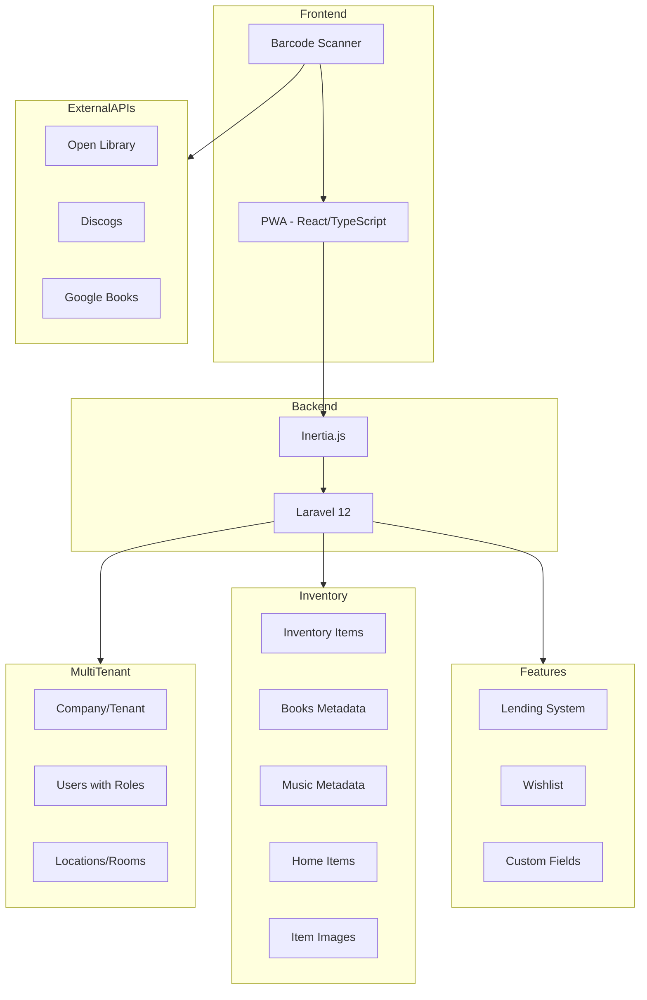

# Personal/Home Inventory App - Build vs Reuse Analysis

**Date:** 2026-01-11  
**Purpose:** Evaluate whether to use the existing InteTeam CRM codebase for a personal inventory application (books, CDs, vinyls, home items) or build a new application.

---

## Executive Summary

**Recommendation: USE THE EXISTING APP with modifications**

The existing InteTeam CRM application provides an excellent foundation for a personal inventory SaaS. The multi-tenancy architecture, PWA support, and inventory management features align well with your requirements. However, the current inventory system is designed for electronics repair parts, so it will need domain-specific adaptations for collectibles.

---

## What the Existing App Already Has

### Multi-Tenancy ✅ Perfect Fit
- **Company-based isolation** - Each user/family gets their own `company_id`
- **Role-based access control** - View Only, Full Access, Warehouse Manager, Admin
- **Team invitations** - Share collections with family/friends via email invites
- **Scalable to 500+ tenants** - Architecture designed for SaaS scale

### PWA Support ✅ Ready
- **Add to Home Screen** - Documented in [`docs/features/pwa/README.md`](../docs/features/pwa/README.md)
- **Service Worker** - Basic caching for offline access
- **Standalone mode** - No browser UI when installed
- **Mobile-first** - React/Inertia frontend

### Inventory Foundation ✅ Adaptable
- **Inventory Items table** - [`docs/database/migrations/005_create_inventory_items_table.md`](../docs/database/migrations/005_create_inventory_items_table.md)
  - SKU, name, description
  - Quantity tracking
  - Cost/sell price
  - Warehouse/location support
- **Stock Movements** - Full audit trail of changes
- **Warehouses** - Can be repurposed as Locations/Rooms/Shelves
- **Multi-warehouse support** - Track items across multiple locations

### Technical Stack ✅ Modern
- **Laravel 12** - Latest PHP framework
- **React + TypeScript** - Modern frontend
- **Inertia.js** - SPA-like experience without API complexity
- **Docker** - Easy deployment
- **Pest 4** - Comprehensive testing
- **PHPStan Level 9** - Type safety

---

## What Needs to Be Added/Modified

### 1. Domain-Specific Item Types
The current `inventory_items` table is generic. For collectibles, you need:

```
New Tables/Fields Needed:
├── item_types (book, cd, vinyl, home_item, etc.)
├── books_metadata
│   ├── isbn
│   ├── author
│   ├── publisher
│   ├── publication_year
│   ├── genre
│   ├── page_count
│   └── edition
├── music_metadata (for CDs/Vinyls)
│   ├── artist
│   ├── album_title
│   ├── release_year
│   ├── genre
│   ├── format (CD, Vinyl, Cassette)
│   ├── condition (Mint, VG+, VG, G, Fair, Poor)
│   └── barcode/catalog_number
├── home_items_metadata
│   ├── category
│   ├── brand
│   ├── model
│   ├── purchase_date
│   ├── warranty_expiry
│   └── serial_number
└── item_images
    ├── cover_art
    └── additional_photos
```

### 2. Barcode/ISBN Scanning
- **Camera integration** - Use device camera for scanning
- **External API integration** - Fetch metadata from:
  - Open Library API (books)
  - Discogs API (vinyl/CDs)
  - Google Books API
  - MusicBrainz API

### 3. Location Hierarchy
Repurpose warehouses as a flexible location system:
```
Location Hierarchy:
├── Home (top level - like warehouse)
│   ├── Living Room
│   │   ├── Bookshelf A
│   │   └── Media Cabinet
│   ├── Office
│   │   └── Desk Drawer
│   └── Storage
│       ├── Box 1
│       └── Box 2
```

### 4. Lending/Borrowing Feature
```
New Table: loans
├── item_id
├── borrower_name
├── borrower_contact
├── lent_date
├── due_date
├── returned_date
└── notes
```

### 5. Wishlist Feature
```
New Table: wishlists
├── company_id
├── item_type
├── title/name
├── metadata (JSON)
├── priority
├── target_price
├── notes
└── added_date
```

### 6. Custom Fields
Allow users to define their own fields per item type:
```
New Tables:
├── custom_field_definitions
│   ├── company_id
│   ├── item_type
│   ├── field_name
│   ├── field_type (text, number, date, select)
│   └── options (for select type)
└── custom_field_values
    ├── item_id
    ├── field_definition_id
    └── value
```

---

## Comparison: Reuse vs Build New

### Option A: Reuse Existing App

| Aspect | Assessment |
|--------|------------|
| **Multi-tenancy** | ✅ Already built and tested |
| **PWA** | ✅ Already planned/documented |
| **Authentication** | ✅ Complete with 2FA |
| **Role-based access** | ✅ 4-tier system ready |
| **Team invitations** | ✅ Email invitation flow |
| **Inventory base** | ✅ Needs domain adaptation |
| **Testing framework** | ✅ Pest 4 with 935 tests |
| **Documentation** | ✅ Comprehensive SOPs |
| **Development time** | ~2-4 weeks for adaptations |
| **Risk** | Low - proven architecture |

### Option B: Build New App

| Aspect | Assessment |
|--------|------------|
| **Multi-tenancy** | ❌ Build from scratch |
| **PWA** | ❌ Build from scratch |
| **Authentication** | ❌ Build from scratch |
| **Role-based access** | ❌ Build from scratch |
| **Team invitations** | ❌ Build from scratch |
| **Inventory base** | ✅ Purpose-built for collectibles |
| **Testing framework** | ❌ Set up from scratch |
| **Documentation** | ❌ Write from scratch |
| **Development time** | ~8-12 weeks minimum |
| **Risk** | Higher - untested architecture |

---

## Recommended Approach

### Phase 1: Foundation Adaptation (Week 1-2)
1. **Rename/rebrand** - Change from InteTeam CRM to your inventory app name
2. **Simplify roles** - Reduce to Owner, Editor, Viewer for personal use
3. **Adapt warehouses** - Rename to Locations with hierarchy support
4. **Add item types** - Create polymorphic item type system

### Phase 2: Domain Features (Week 2-3)
1. **Book metadata** - ISBN lookup, author, publisher fields
2. **Music metadata** - Artist, album, condition grading
3. **Home items** - Category, brand, warranty tracking
4. **Image upload** - Cover art and photos

### Phase 3: Enhanced Features (Week 3-4)
1. **Barcode scanning** - Camera integration with API lookups
2. **Lending system** - Track who borrowed what
3. **Wishlist** - Want list with price tracking
4. **Custom fields** - User-defined metadata

### Phase 4: Polish (Week 4+)
1. **PWA completion** - Offline support, push notifications
2. **Reports** - Collection statistics, value reports
3. **Import/Export** - CSV, Discogs, Goodreads imports
4. **Mobile optimization** - Touch-friendly UI

---

## Architecture Diagram



---

## Risk Assessment

### Low Risk Items
- Multi-tenancy - Already proven at scale
- Authentication - Complete with 2FA
- PWA basics - Documented and planned
- Database architecture - Designed for 500+ tenants

### Medium Risk Items
- Barcode scanning - Requires camera API integration
- External API rate limits - Need caching strategy
- Mobile UX - Current UI is desktop-focused

### Mitigation Strategies
1. **Barcode scanning** - Use established libraries like QuaggaJS or ZXing
2. **API limits** - Implement aggressive caching, allow manual entry fallback
3. **Mobile UX** - Prioritize mobile-first redesign of key screens

---

## Conclusion

**Use the existing app.** The multi-tenancy, PWA, and inventory foundations save 6-8 weeks of development time. The adaptations needed are additive rather than architectural changes, making this a lower-risk approach.

The existing codebase has:
- Proven multi-tenant architecture for 500+ tenants
- Comprehensive testing with 935 passing tests
- Detailed documentation and SOPs
- Modern tech stack with Laravel 12, React, TypeScript

The main work is domain adaptation - adding book/music/home item metadata, barcode scanning, and lending features on top of the solid foundation.

---

## Next Steps

If you approve this approach:

1. **Create feature branch** - `feature/personal-inventory-adaptation`
2. **Document new requirements** - Create `/docs/features/personal_inventory/README.md`
3. **Plan database migrations** - Design new metadata tables
4. **Prototype barcode scanning** - Test camera API integration
5. **Design mobile-first UI** - Wireframes for key screens

Would you like me to proceed with creating a detailed implementation plan?
