# Routes Refactoring Plan

## Current State Analysis

The [`routes/web.php`](../routes/web.php) file has grown to **569 lines** and contains multiple distinct route groups that should be separated for better maintainability.

## Proposed Route File Structure

### Overview Diagram

```mermaid
graph TD
    A[web.php - Main Router] --> B[public.php]
    A --> C[guest.php]
    A --> D[invitations.php]
    A --> E[collector.php]
    A --> F[admin-settings.php]
    A --> G[root-admin.php]
    A --> H[company.php]
    A --> I[galleries.php]
    A --> J[scheduler.php]
    A --> K[bookings.php]
    A --> L[cms-pages.php]
    
    B --> B1[Welcome, Privacy, Terms]
    B --> B2[Embed Booking]
    
    C --> C1[Register, Login]
    C --> C2[Password Reset]
    C --> C3[Two-Factor Challenge]
    
    D --> D1[Invitation Acceptance]
    
    E --> E1[Dashboard]
    E --> E2[Collections]
    E --> E3[Items]
    E --> E4[Locations]
    E --> E5[Loans]
    E --> E6[Wishlist]
    E --> E7[Export]
    E --> E8[Team Management]
    E --> E9[Push Notifications]
    E --> E10[Settings]
    
    F --> F1[Theme]
    F --> F2[Two-Factor]
    F --> F3[Company Details]
    F --> F4[Email Settings]
    F --> F5[Notifications]
    
    G --> G1[User Management]
    
    H --> H1[Company Dashboard]
    H --> H2[Company Settings]
    H --> H3[Team Management]
    
    I --> I1[Admin Galleries]
    I --> I2[Admin Media]
    I --> I3[Manager Galleries]
    I --> I4[Manager Media]
    
    J --> J1[Visits]
    J --> J2[Locations]
    J --> J3[Business Hours]
    J --> J4[Holidays]
    J --> J5[API Keys]
    
    K --> K1[Stage Views]
    K --> K2[Booking Forms]
    K --> K3[Settings]
    K --> K4[Booking Details]
    K --> K5[Todos]
    K --> K6[Notes]
    K --> K7[Team Assignment]
    
    L --> L1[CMS Page Management]
```



## Detailed File Breakdown

### 1. **routes/public.php** (~30 lines)
- Welcome page
- Privacy policy
- Terms of service
- Embed booking routes (no auth required)

**Middleware:** None (public routes)

### 2. **routes/guest.php** (~20 lines)
- Registration
- Login
- Password reset (request, reset)
- Two-factor challenge

**Middleware:** `guest`, `throttle:5,1`

### 3. **routes/invitations.php** (~10 lines)
- Invitation show
- Invitation accept
- Accept pending invitation (authenticated)

**Middleware:** Mixed (some public, some authenticated)

### 4. **routes/collector.php** (~135 lines)
- Dashboard
- Collections (books, CDs, vinyls, home items)
- Items (CRUD)
- Locations (CRUD)
- Loans (index, store, return, extend)
- Wishlist (CRUD, acquire, toggle public)
- Export (JSON/CSV for collection, wishlist, loans, locations)
- Team management (owner only)
- Push notifications
- Settings (owner only)

**Middleware:** `auth`, `collector`

### 5. **routes/admin-settings.php** (~35 lines)
- Theme preference
- Two-factor authentication settings
- Company details settings
- Email settings
- Notification settings
- Admin notifications

**Middleware:** `auth`

### 6. **routes/root-admin.php** (~10 lines)
- System-wide user management
- User CRUD operations
- Company role management

**Middleware:** `auth`, `root`

### 7. **routes/company.php** (~50 lines)
- Company dashboard
- Company settings
- Team management
- Company invitations
- User management within company

**Middleware:** `auth`, `company`, `admin`

### 8. **routes/galleries.php** (~80 lines)
- Admin gallery management
- Admin media management
- Manager gallery management
- Manager media management

**Middleware:** `auth`, `company`, `admin` (for admin routes)

### 9. **routes/scheduler.php** (~40 lines)
- Visit management
- Location settings
- Business hours
- Holidays
- API keys

**Middleware:** `auth`, `company`, `admin`

### 10. **routes/bookings.php** (~60 lines)
- Stage views (incoming, undergoing, completed)
- Booking forms management
- Settings (stage statuses, todo templates)
- Booking details and actions
- Booking todos
- Booking notes
- Team assignment

**Middleware:** `auth`, `company`, `admin`

### 11. **routes/cms-pages.php** (~15 lines)
- CMS page CRUD
- Publish/unpublish actions

**Middleware:** `auth`, `company`, `admin`

### 12. **routes/web.php** (Refactored - ~30 lines)
- Include all route files
- Session heartbeat
- Component test page (development)
- Logout route

## Benefits of This Refactoring

1. **Improved Maintainability**: Each file has a single, clear responsibility
2. **Easier Navigation**: Quickly find routes for specific features
3. **Better Collaboration**: Multiple developers can work on different route files without conflicts
4. **Clearer Middleware Grouping**: Each file documents its middleware requirements
5. **Scalability**: Easy to add new route files for future features
6. **Consistency**: Follows existing pattern (cms.php, inventory.php, tasks.php, etc.)

## Implementation Steps

1. Create new route files in the `routes/` directory
2. Move appropriate route groups from `web.php` to each new file
3. Update `web.php` to include all new route files using `require_once`
4. Test all routes to ensure functionality is preserved
5. Update any documentation that references route structure

## File Naming Convention

Following the existing pattern:
- Use lowercase, hyphenated names: `admin-settings.php`, `root-admin.php`
- Group related functionality: `collector.php`, `bookings.php`, `scheduler.php`
- Keep names descriptive and concise

## Middleware Documentation

Each route file will include a header comment documenting:
- Purpose of the routes
- Required middleware
- Route prefix (if applicable)
- Authorization requirements

Example:
```php
/**
 * Collector Routes
 * 
 * Purpose: Personal inventory management for collectors
 * Middleware: auth, collector
 * Prefix: /collector
 * Authorization: Owner-only routes require 'can:manage-team' or 'can:manage-settings'
 */
```

## Testing Checklist

After refactoring, verify:
- [ ] All public routes work without authentication
- [ ] Guest routes redirect properly after login
- [ ] Collector routes are accessible only to collector users
- [ ] Admin routes require appropriate permissions
- [ ] Route names remain unchanged
- [ ] URL patterns remain unchanged
- [ ] All tests pass
- [ ] No route conflicts or duplicates
